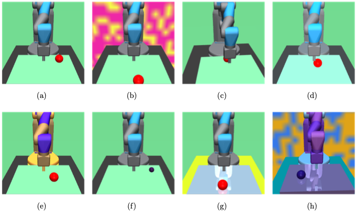

# Custom Fetch Gym Environment
The Gym robotics environments randomly choose a goal in 3D space. The robots task is to reach the goal with its end effector or move an object towards the goals direction.
In order to evaluate visual generalization with the Fetch environment, it is adapted with random modifications. The following elements of the environment are visually modified:
    
- b) Background : The background texture is set to a picture randomly generated from two RGB colors with noise.
- c) Camera: Slight variations from the original camera position and rotation are sam- pled from a relatively small range. The camera modifications do not hide information relevant for the task.
- d) Lighting: Light position and ambiance, and diffusion properties vary randomly within a small range from the original properties.
- e) Robot Color: The robot design uses a color scheme of 3 colors. The color scheme is randomly sampled from the RGB space.
- f) Target: Size and color of the target sphere are randomly set.
- g) Table: The table color and reflectance intensity are randomly sampled.
- g) Floor Color: The floor color is a randomly sampled RGB color.

## Prerequisites
Download and install Mujoco to ~/.mujoco, following their instructions (including setting LD_LIBRARY_PATH in your ~/.bashrc file).
Install the mujoco_py package from source: https://github.com/openai/mujoco-py

## Credits
This repository is based on the [robotics environments](https://github.com/openai/gym/tree/master/gym/envs/robotics) from OpenAI [Gym](https://github.com/openai/gym).

